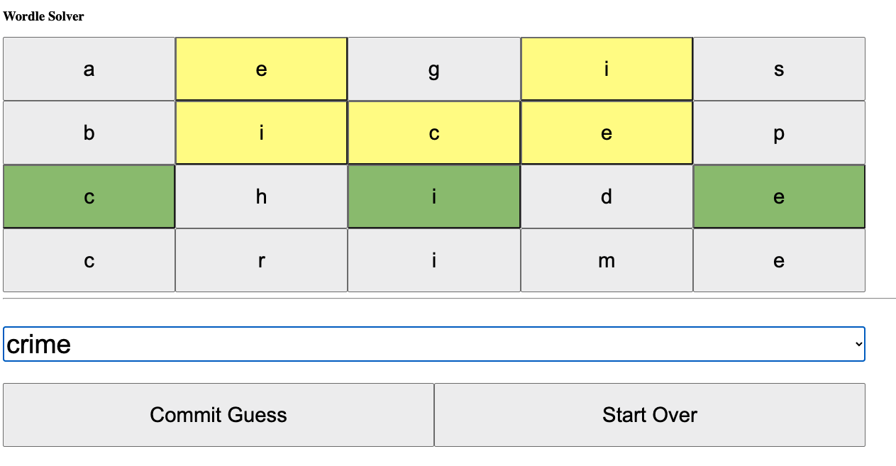

## Wordle Game Solver

[Try the Demo Here](http://benfalk.com/wordle-solver/)

Built with `yew` as an embeded rust wasm project.  You'll need rust
1.60.0-nightly+ if you want to build it yourself.

### Build It Yourself

1. `rustup target add wasm32-unknown-unknown`
2. `cargo install trunk`
3. `trunk build --release`
